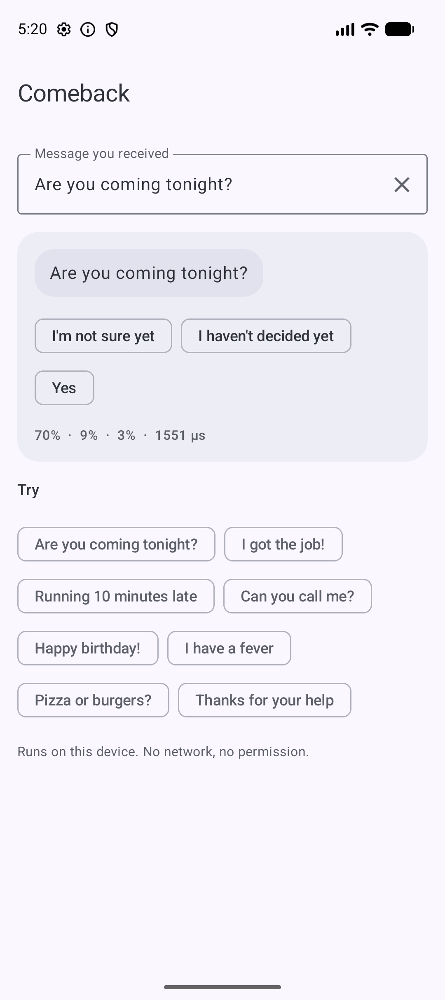
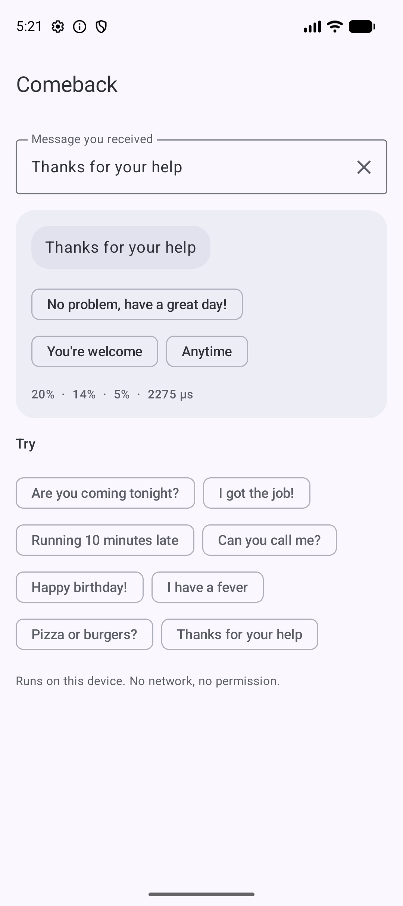
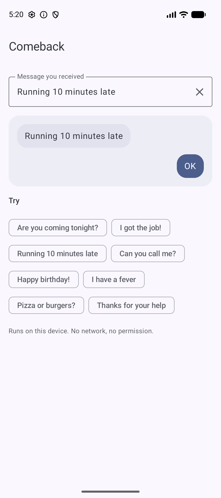
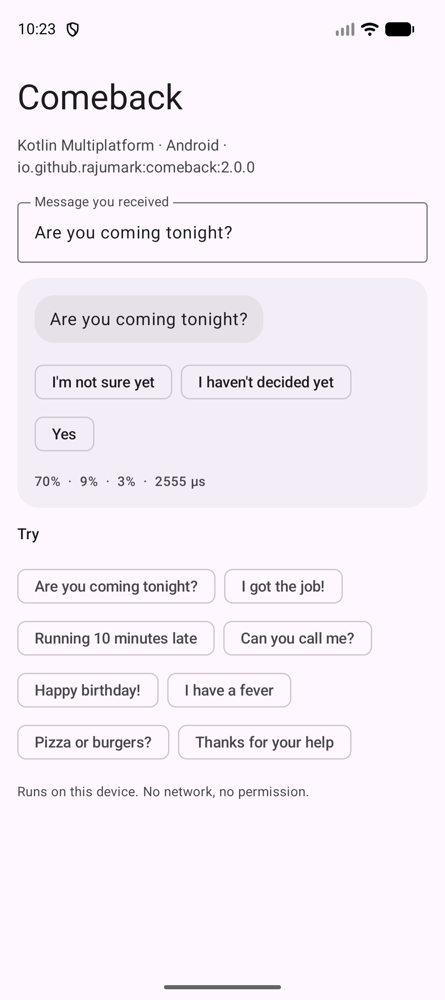
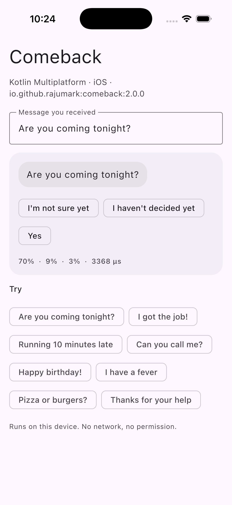
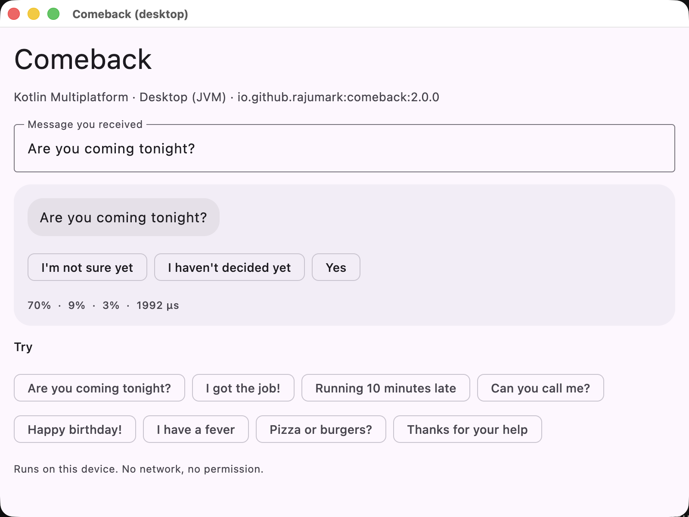
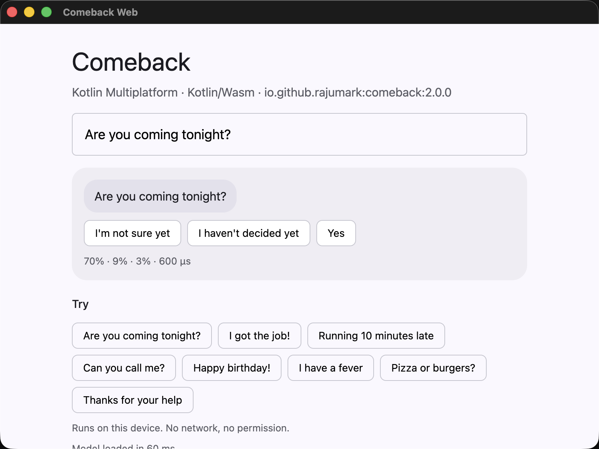

# Comeback 💬

By Hoverfly. On-device smart replies for **Kotlin Multiplatform**: Android, iOS, macOS, JVM desktop, JavaScript and WebAssembly. It reads the message you received and suggests short replies to tap, like the reply chips in messaging apps.

```kotlin
import io.github.rajumark.hoverfly.comeback.Comeback

Comeback().use { comeback ->
    comeback.replies("Thanks for your help")   // [No problem, have a great day!] [You're welcome] [Anytime]
}
```

- **Safe by design.** Replies are picked from a fixed, reviewed list of about 1,300 short replies, never generated, so it can't write something rude or odd. About 100 unhelpful replies ("What?", "Huh", "Yes, sir") are never shown.
- **Different chips.** At most one reply per intent group, so the 3 chips mean different things.
- **No dependencies.** Inference is plain Kotlin. There is no ONNX Runtime, TFLite, ML Kit or native code, so the library adds about 5 MB to an app.
- **Private and offline.** The model ships inside the library on every platform. There is no network, no permission and no telemetry.
- **Fast.** About 0.5 ms per message on an Android emulator (Apple silicon), ~0.2 ms on the JVM.
- **minSdk 21.** Works from Kotlin and Java. English (v1).

## Install

```kotlin
// build.gradle.kts: commonMain, or any platform source set
dependencies {
    implementation("io.github.rajumark:comeback:2.0.0")
}
```

It's on Maven Central, so no extra repository is needed. Gradle picks the right artifact for each platform:

| Platform | Artifact |
|---|---|
| Android (minSdk 21) | `comeback-android` |
| JVM desktop (Java 8+) | `comeback-jvm` |
| iOS device and simulator (arm64) | `comeback-iosarm64`, `comeback-iossimulatorarm64` |
| macOS (arm64) | `comeback-macosarm64` |
| JavaScript (browser, Node) | `comeback-js` |
| WebAssembly (browser, Node) | `comeback-wasm-js` |

The Android-only 1.x releases are on JitPack: `com.github.rajumark:comeback:v1.x`.

Upgrading from 1.x on Android: `Comeback(context)` still compiles in Kotlin (deprecated). The model no longer needs a `Context`, so switch to `Comeback()`. Java code must change `new Comeback(context)` to `new Comeback()`.

## Screenshots

The sample app on an emulator. Replies are computed on the device, with no network round trip.

| Plans | Thanks | Reply sent |
|---|---|---|
|  |  |  |
| "Are you coming tonight?" | "Thanks for your help" | "Running 10 minutes late" → OK |

The KMP sample on each platform:

| Android | iOS | Desktop | Web (Wasm) |
|---|---|---|---|
|  |  |  |  |

## Use

```kotlin
import io.github.rajumark.hoverfly.comeback.Comeback

val comeback = Comeback()        // loads the model: ~50–200 ms, do it off the main thread, keep one instance

val replies = comeback.replies("Let's meet at 7")
replies.map { it.text }                  // [OK, OK, see you then, See you there!]
replies.first().confidence               // 0.31

comeback.replies("See you tomorrow", limit = 1)                 // [See you]
comeback.replies("Pizza or burgers?", minConfidence = 0.2f)     // [] - nothing fits well, show no chips

comeback.close()                         // frees the model's memory
```

`replies()` is thread-safe. It returns an empty list for a blank message.

With coroutines:

```kotlin
val comeback = withContext(Dispatchers.Default) { Comeback() }
```

From Java:

```java
try (Comeback comeback = new Comeback()) {
    List<SmartReply> r = comeback.replies("Are you coming tonight?");
}
```

### API

| | |
|---|---|
| `Comeback()` | Loads the bundled model. `AutoCloseable`. |
| `replies(message, limit = 3, minConfidence = 0f)` | The best replies first, one per intent group. Returns `List<SmartReply>`. |
| `SmartReply(text, confidence)` | One reply. |

Use `minConfidence` to hide the chips when nothing fits well. Around 0.2 hides them for many opinion and open questions; tune it on your own messages.

## Quality

Measured on 335 hand-written messages across 16 categories (a reply counts as good when a person would plausibly send it). The Comeback numbers are from the same trained model before it was converted to this library's format; the conversion keeps the top reply the same on 99.4% of messages.

| | Comeback | Google ML Kit Smart Reply |
|---|---|---|
| a good reply in the top 3 | 63.6% | 72.8% |
| top reply is good | 42.1% | 52.8% |
| answers every message | yes | 95% |
| size | 4.6 MB | 6.6 MB + 4.4 MB native libs |
| latency (Android emulator on Apple silicon) | ~0.5 ms | ~16.6 ms (p50) |
| dependencies | none | ML Kit + native code |

ML Kit gives better replies. Comeback is smaller, much faster, has no native code or Google Play services requirement, and you can read and change the reply list.

Strong categories: thanks (100% good in top 3), yes/no questions (90%), affection, goodbyes. Weak: opinions ("Pizza or burgers?"), open questions and information messages, where a short canned reply rarely fits. Use `minConfidence` there.

## Sample apps

`sample/` is a separate Gradle build that uses the **published** library, never the source. It resolves `io.github.rajumark` only from Maven Local, or from Maven Central with `-PcomebackRepo=central`. It has a Compose Multiplatform app for Android, desktop and iOS, and a web page built for both Kotlin/JS and Kotlin/Wasm.

```bash
./gradlew :comeback:publishToMavenLocal
cd sample
./gradlew :androidApp:installRelease
./gradlew :desktopApp:run
./gradlew :webApp:wasmJsBrowserDevelopmentRun     # or :webApp:jsBrowserDevelopmentRun
open iosApp/iosApp.xcodeproj                       # run the iosApp scheme on a simulator
```

## Project layout

```
comeback/                      the library
  src/commonMain/              public API (Comeback, SmartReply) and the model in plain Kotlin
                               (internal/: Featurizer, SentencePiece, Network, UnicodeTables)
  src/{jvm,android,apple,js,wasmJs}Main/   the only platform code: NFKC normalization + model loading
  src/modelData/               comeback.bin (int8 weights) · spm_pieces.tsv (tokenizer) · replies.tsv (the reply set)
  src/commonTest/              parity with Python on 354 vectors, API, latency; runs on every target
sample/                        demo apps using the published artifacts
scripts/GenTables.java         generates UnicodeTables.kt (character classes) so every platform agrees
docs/                          website (rajumark.github.io/comeback)
```

On JVM and Android the model ships as Java resources in the jar/AAR. Kotlin/Native and the web have no resources, so the build compiles it into the library (`generateEmbeddedModel`).

## Tests

```bash
./gradlew :comeback:jvmTest
./gradlew :comeback:testAndroidHostTest
./gradlew :comeback:connectedAndroidDeviceTest              # on a connected device/emulator
./gradlew :comeback:iosSimulatorArm64Test
./gradlew :comeback:macosArm64Test
./gradlew :comeback:jsNodeTest :comeback:jsBrowserTest
./gradlew :comeback:wasmJsNodeTest :comeback:wasmJsBrowserTest
```

The parity tests require identical token and n-gram ids, the same top-1 reply, the same top-5 and the same 3 shown replies as the Python reference on all 354 vectors, on every target. The current maximum probability difference is 2.3e-6.

## How it works

It uses the same two-stream network as [Moji](https://github.com/rajumark/moji): hashed character n-grams and words on one side, SentencePiece tokens through one transformer layer on the other, then an MLP that scores every reply in the list. Weights are int8 with one scale per row.

## Publishing

See [PUBLISHING.md](PUBLISHING.md).

## Pricing & license

**Free for up to 10,000 monthly active devices.** You don't need an API key, an account or a license file: add the dependency and ship. It works in commercial apps too, with no limit on how often each device runs it.

| | Community | Commercial | Custom models |
|---|---|---|---|
| **Price** | Free | Contact us | Contact us |
| **For** | Products with up to 10,000 monthly active devices per platform | Products above 10,000 monthly active devices on any platform | A model trained for your own language, domain or task |
| **Includes** | Commercial use, unlimited calls, no key or sign-up | One license per product per model, direct support, early access to updates | Designed and trained by Hoverfly, shipped as a plain Kotlin library |

**How devices are counted.** A monthly active device is a device that runs Comeback at least once in a calendar month. The limit applies separately to each product, each platform (Android, iOS, web…) and each Hoverfly model. Once a product passes it, you have 30 days to get a commercial license. The library keeps working and never checks in with a server.

**Not allowed** under any tier (unless agreed in writing):

- selling or redistributing Comeback or its model on its own, or inside another SDK or library
- extracting, modifying, fine-tuning or retraining the model weights
- using the model or its outputs to train or distill another model
- reverse engineering the model or its file format
- offering it as a hosted API for others

**Custom models.** Hoverfly also designs and trains small, fast on-device models for your needs: moderation, classification, language detection, smart replies and more.

**Contact** for a commercial license or a custom model: [raju348636@gmail.com](mailto:raju348636@gmail.com) or **+91 63533 21951** (call or WhatsApp).

Full terms: [Hoverfly Community License](LICENSE). Versions 1.0.0 and earlier were released under Apache-2.0.
